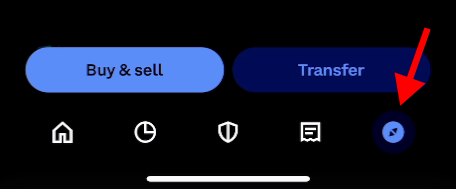
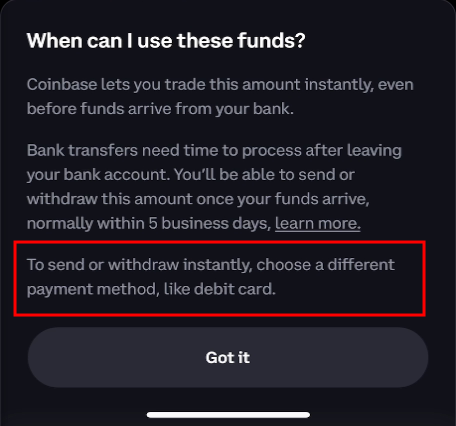

# How to go from Coinbase to ApeChain
Quick write up on how to move money from your debit card (or bank account) to ApeChain in a few minutes. I want to cover a few different methods.

## Home Base
- Open the Coinbase app on your mobile device
- Navigate to the `Explore` tab in the lower right hand corner

- Find Ethereum under `Top Assets` and select it to open up the asset page
- Tap the `Transfer` button in the lower right hand corner
- Tap the `Send` button
- Select the Base network (which allows for free withdrawals)
    - Select `Yes, it's supported`
- Copy the wallet address you want to use on ApeChain
    - Whatever app works for transferring the wallet address from desktop to mobile
- Paste the wallet address from clipboard into the Coinbase app
- Enter the amount of USD you want to send
- Tap the `Preview` button

### Purchase ETH
- You'll need to top up so tap the `Buy ETH` button
- Select the appropriate payment method
    - For speed, use the debit card option
    - **NOTE:** Personally, ACH transfers have worked but Coinbase advises against it if you want instant withdrawals
    

- Tap the `Buy Now` button
- Make note of the price and fees of the purchase
- Wait for pending order, typically email confirmation within a few minutes

### Transfer ETH to Base
- Attempt to transfer the ETH to your wallet again
- Navigate back through Explore > Ethereum > Transfer > Send
- Select the Base network (which allows for free withdrawals)
    - Select `Yes, it's supported`
- Copy the wallet address you want to use on ApeChain
- Paste the wallet address from clipboard into the Coinbase app
- Triple check the wallet address
- Send the max amount of ETH available
- Tap the `Preview` button
- Select `Send Now`
- Verify 2FA
- Tap the `View Details` button
- Verify the funds have arrived via basescan.org

### Resorvoir Relay
*Note: These steps are written for desktop but it's possible to complete them on mobile*
- Open the Relay Bridge to ApeChain
    - https://relay.link/bridge/ape
- Select `Connect Wallet`
    - Connect your wallet to relay.link
- Select `ETH` in the lower right hand side of the `From` token
    - Select `Base`
    - Find and select your Base `Ether`
- `Ape Chain` and `APE` should auto populate in the `To` field
- Enter the amount of ETH you want to bridge
    - NOTE: Make sure to [leave enough ETH behind](#additional-notes) for gas fees
        - On Base `$1.00` worth of ETH should allow for quite a few basic transactions
        - At the time of writing a dollar is around 0.0005 ETH
- Select the `Trade` button
- Review the bridge transaction details
    - Aim for `Price Impact` to be less than 2%
    - `From address` and `To address` should be the same - your address
- Confirm the trade^

### Rabby Interaction
Your Rabby wallet will open and show transaction details
- Review transaction speed and gas fees
    - *ADVANCED:* Set a `Custom` `Gas Price (Gwei)` and `Max Priority Fee` if time is **not** of the essence
        - Check a gas tracker to get an idea of low and high gwei for the day
            - https://dune.com/payton/base-l2-gas-price-tracker
        - `Max Priority Fee` of 1.5 Gwei typically works - use a higher value if any doubts
        - **WARNING:** You only have 30 minutes to get most DEX transactions to confirm _(Relay included)_
- `Sign` and `Confirm` the transaction
- After a few moments you should see `Successfully swapped`

### Road to ApeChain
- Open both transactions on the Base block explorer and ApeChain block explorer
- Confirm the funds have arrived on ApeChain in your wallet address
    - Use https://apescan.io/
- Select `View Details` on the Relay Bridge confirmation page
    - **BONUS:** Collect information about the fees paid
        - Deposit Gas, Fill Gas, and Relay Fee
- Visit https://apechain.com/ and use a few apps!

## Arbitrum Ape
Hat tip to Melbo.eth for the outline of this method
- Open the Coinbase app on your mobile device
- Navigate to the `Explore` tab in the lower right hand corner

 
- Find Ethereum under `Top Assets` and select it to open the asset page
- Tap the `Transfer` button in the lower right hand corner
- Tap the `Send` button
- Select the Arbitrum network
    - Select `Yes, it's supported`
- Copy the wallet address you want to use on ApeChain
- Paste the wallet address from clipboard into the Coinbase app
- Enter your desired USD amount (e.g. $20)
- Tap the `Preview` button

### Purchase ETH
- You'll need to top up so tap the `Buy ETH` button
- Select the appropriate payment method
    - For speed, use the debit card option
    - **NOTE:** ACH transfers work but may delay instant withdrawals
    

- Tap the `Buy Now` button
- Wait for pending order, typically email confirmation within a few minutes

### Transfer ETH to Arbitrum
- Attempt to transfer the ETH to your wallet again
- Navigate back through Explore > Ethereum > Transfer > Send
- Select the Arbitrum network
    - Select `Yes, it's supported`
- Copy the wallet address you want to use on ApeChain
- Paste the wallet address from clipboard into the Coinbase app
- Triple check the wallet address
- Send the max amount of ETH available
- Tap the `Preview` button
- Select `Send Now`
- Verify 2FA
- Tap the `View Details` button
- Verify the funds have arrived via arbiscan.io

### Ape Portal Bridge
*Note: These steps are for desktop but it's possible to complete them on mobile*
- Visit ApeChain Portal
    - https://apechain.com/portal
- Select `Connect Wallet`
    - Connect your wallet to apechain.com
- In the `From` section:
    - Select the `APE` drop down
    - Select `Arbitrum` network
    - Select `ETH` token
- The `To` section should show ApeChain by default
- Enter the amount of ETH to bridge
    - NOTE: [Leave enough ETH behind](#additional-notes) for Arbitrum gas fees
- The portal button should now say `Switch network to Arbitrum One`
    - Select the button and switch networks
- Click the `Bridge` button
- Review the transaction details
    - Check estimated gas fees
    - Verify addresses match
- Click `Bridge` to confirm

### Rabby Interaction
Your Rabby wallet will open and show transaction details
- Review transaction speed and gas fees
    - *ADVANCED:* Adjust `Gas Price (Gwei)` and `Max Priority Fee` if needed
        - Check a gas tracker for current rates
            - https://ct.app/gasPrice/ape
        - `Max Priority Fee` of 1.5 Gwei typically works - use a higher value if any doubts
        - **WARNING:** You only have 30 minutes to get most DEX transactions to confirm _(Portal included)_
- `Sign` and `Confirm` the transaction
- After a few moments you should see `Transaction Completed`

### ApeChain Arrival
- `View transaction` on the Ape Portal
- Open both transactions, source and destination
- Verify funds have arrived on ApeChain
    - Use https://apescan.io/
- **BONUS:** Check transaction fees on both networks
    - arbiscan.io for Arbitrum fees
    - apescan.io for ApeChain fees
- Visit https://apechain.com/ and use a few apps!

## Additional Notes
- **Gas Fees:** *When swapping or bridging always leave enough ETH for a few future transactions.
- **Alternative DEX:** Explore other DEXs for an L2 or Mainnet to Arbitrum transfer, that may further reduce costs.